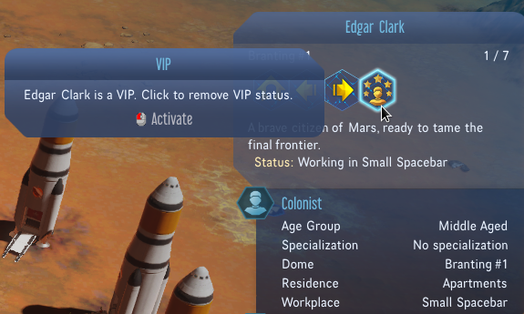
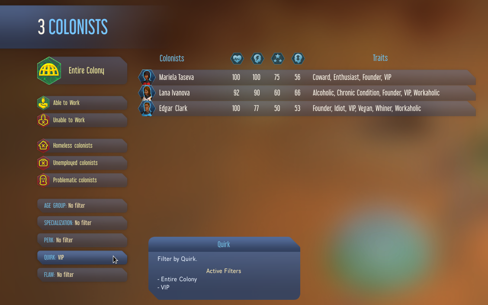
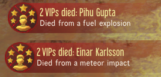
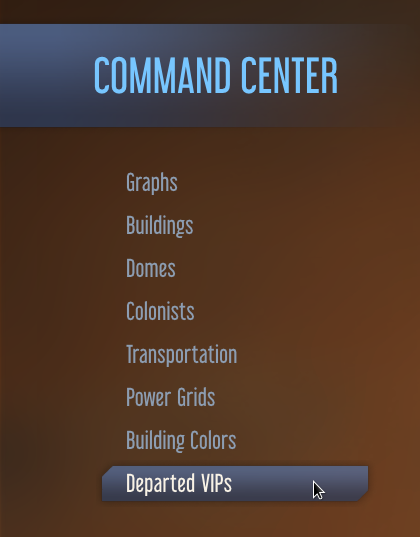

# VIP Tracker

This mod is Gagarin compatible (both base game and with Space Race).

This mod enables you to mark individual colonists as ones that you wish to track.  
  
These colonists are given a Quirk called "VIP" so that they can be listed in the Colony Command Center colonist filters.  
  
Double-clicking on a colonist in this colonist list will zoom you to where they are.

When a VIP dies, the mod keeps track of their age at death, the Sol they died, and what their cause of death was.
A notification is popped up that allows you to zoom to the dead VIP.  
  
An additional option is also added to the Colony Command Center to view the list of deceased VIPs.  
  
  

## Acknowledgements

The original idea for this mod came from [CheTranqui](https://github.com/CheTranqui) with the mod "Neighbourhood Watch".
VIP Tracker is a complete rewrite of the ideas from "Neighbourhood Watch" made with CheTranqui's blessing.

Other people that helped with working out how to make parts of the mod work include [ChoGGi](https://github.com/ChoGGi) and SkiRich, plus others in the Surviving Mars Modding Discord.

## Downloading the mod

Steam: https://steamcommunity.com/sharedfiles/filedetails/?id=1574069378
NexusMods: https://www.nexusmods.com/survivingmars/mods/99

## Mod Integration

If you have a mod that adds extra "types" of deaths, it is possible to add to the list of death reasons used in the VIP death notifications and Deceased VIP lists.

To detect if the VIP Tracker mod is active:
```lua
function OnMsg.VIPTrackerModLoaded()
end
```

Inside this message handler, you can use the function `VIPTrackerMod.Functions.AddDeathReason(reason, reason_msg)` where the `reason` field is what gets stored in `colonist.dying_reason`, and the `reason_msg` field is the translatable message to display in notifications/deceased list for that reason. Note that the reason message will have "Died from" prepended to the message.

e.g.
```lua
function OnMsg.VIPTrackerModLoaded()
    local AddDeathReason = VIPTrackerMod.Functions.AddDeathReason
    
    AddDeathReason('fell', T{123456789, "falling off a balcony"})
    AddDeathReason('fright', T{123456790, "being scared to death"})
    ...
end
```
