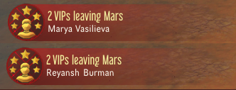
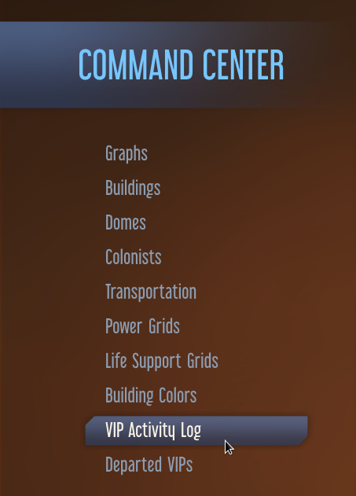
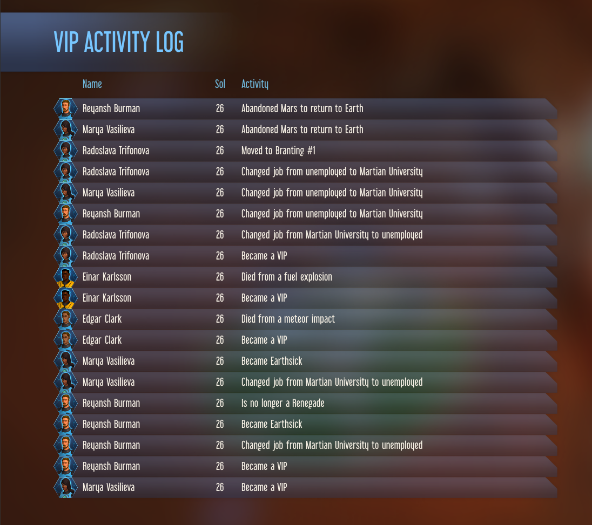
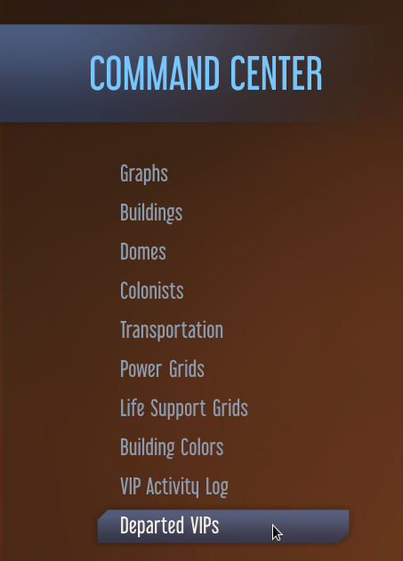
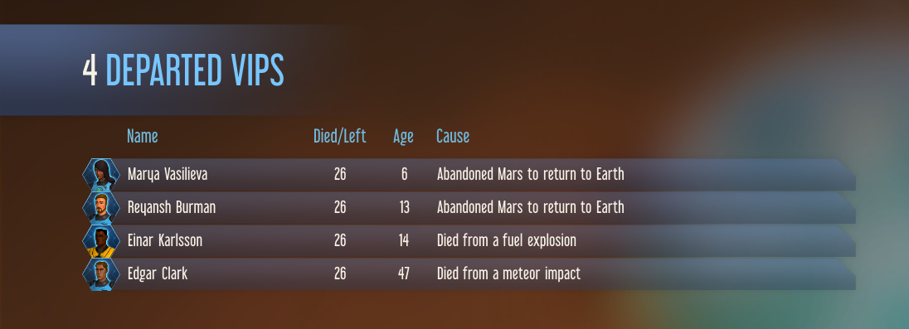

# VIP Tracker

This mod is Below and Beyond compatible (base game, or with any expansions).

This mod enables you to mark individual colonists as ones that you wish to track.  
  
These colonists are given a Quirk called "VIP" so that they can be listed in the Colony Command Center colonist filters.  
  
Double-clicking on a colonist in this colonist list will zoom you to where they are.

When a VIP dies, the mod keeps track of their age at death, the Sol they died, and what their cause of death was.
A notification is popped up that allows you to zoom to the dead VIP.  
  

When a VIP boards a rocket to return to Earth, the mod keeps track of their age at time of boarding and the Sol that they boarded the rocket.
A notification is popped up that allows you to cycle through the names of VIPs that are leaving Mars.  
  

Two new options are added to the Colony Command Center. The first option:  
  
provides an ongoing record of changes in the lives of VIPs - items like moving to a new Dome, graduating University, getting older, etc.  
  
The second option:  
  
provides a record of the VIPs that have either died or returned to Earth.  

## Acknowledgements

The original idea for this mod came from [CheTranqui](https://github.com/CheTranqui) with the mod "Neighbourhood Watch".
VIP Tracker is a complete rewrite of the ideas from "Neighbourhood Watch" made with CheTranqui's blessing.

Other people that helped with working out how to make parts of the mod work include [ChoGGi](https://github.com/ChoGGi) and SkiRich, plus others in the Surviving Mars Modding Discord.

## Downloading the mod

Steam: <https://steamcommunity.com/sharedfiles/filedetails/?id=1574069378>  
NexusMods: <https://www.nexusmods.com/survivingmars/mods/99>
